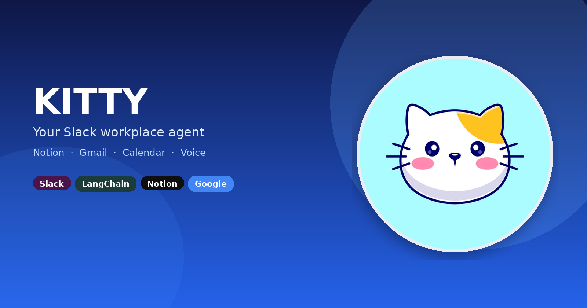

<p align="center">
  
</p>

<p align="center">
  
</p>

<h1 align="center">Kitty</h1>

<p align="center">
  A LangChain Slack workplace agent for <strong>Notion</strong>, <strong>Gmail</strong>, and
  <strong>Google Calendar</strong> — with voice notes in and spoken replies out.
</p>

<p align="center">
  
  
  
  
  
  
</p>

---

## What it does

Talk to Kitty in a Slack DM, mention, or thread (or use the CLI). Chat is the UI.

| Surface | What Kitty can do |
| --- | --- |
| **Notion** | Create, read, append, replace, rename, search, and archive pages |
| **Meeting notes** | Turn notes into action items, then save them to Notion |
| **Gmail** | Search inbox, read a message, save a draft (**never sends**) |
| **Calendar** | List upcoming events; create an event after you confirm |
| **Voice** | Transcribe Slack voice notes (Whisper) and reply with speech (Edge TTS) |
| **Web** | Optional Tavily search when you need outside context |
| **Slack notify** | Ping a channel when you ask |

Destructive Notion writes (archive / overwrite) wait for your confirm.

### Example asks

| You say | Kitty does |
| --- | --- |
| “Create a page called Hiring plan” | New Notion page under your parent page |
| “Add interview-loop notes to Hiring plan” | Appends headings / bullets / paragraphs |
| “What’s on the Hiring plan page?” | Reads the page and summarizes it |
| “Turn these meeting notes into action items…” | Extracts bullets, then creates/appends a page |
| “Search my inbox for Acme” | Gmail search |
| “Draft a follow-up to Sarah…” | Saves a Gmail **draft** only |
| “What’s on my calendar this week?” | Lists events |
| Send a **voice note** | Whisper → agent → text + spoken reply |

---

## How it works

```text
Slack / CLI
    →  src/main.py  or  src/intigration/slack.py
            →  src/agent/agent.py   (LangChain create_agent)
                    →  llm.py  (Ollama / Groq / OpenRouter)
                    →  tools in mcp_tools/registry.py
                           │
           ┌───────────────┼───────────────┐
           ▼               ▼               ▼
        Notion API     Gmail API      Calendar API
        (+ voice in/out via audio.py + tts.py)
```

1. You mention Kitty, DM it, type in the CLI, or send a voice note.
2. The agent picks tools (Notion, Gmail, Calendar, …).
3. It calls the real APIs and replies in the same Slack thread.
4. Voice notes: Whisper transcript → agent → text update + optional mp3 reply.
5. Archive / overwrite / calendar create only after you say yes.

---

## Quick start (&lt; 5 minutes)

Python 3.12+ and an LLM (Ollama locally, or Groq / OpenRouter).

### 1. Install

```bash
cd kitty
python -m venv .venv
source .venv/bin/activate
pip install -r requirements.txt
# or: uv pip install --python .venv/bin/python -r requirements.txt
```

### 2. Configure `.env`

Copy the keys you need. Never commit real tokens (`.env` is gitignored).

```env
# LLM — pick one provider
LLM_PROVIDER=ollama
LLM_MODEL_NAME=gpt-oss:120b-cloud
# LLM_API_KEY=          # required for groq / openrouter / gemini

# Notion — share a parent page with the integration
NOTION_API_KEY=ntn_...
# or NOTION_PAT_KEY=...
NOTION_PAGE_ID=                  # default parent for new pages
NOTION_DATABASE_ID=              # optional

# Slack (Socket Mode)
SLACK_BOT_TOKEN=xoxb-...
SLACK_APP_TOKEN=xapp-...

# Google (Gmail + Calendar)
GOOGLE_CLIENT_ID=...
GOOGLE_CLIENT_SECRET=...

# Optional
# TAVILY_API_KEY=tvly-...
```

Switch LLM providers by changing `LLM_PROVIDER` / `LLM_MODEL_NAME` / `LLM_API_KEY`.

### 3. Sign in to Google

Ask Kitty in Slack for mail or calendar. If you are not signed in, it posts a
**Sign in with Google** card — tap it on the computer running Kitty. That writes
`token.json` in the project root (gitignored).

You can still log in from the terminal:

```bash
cd kitty
PYTHONPATH=src .venv/bin/python -m intigration.gmail
```

### 4. Run

```bash
cd kitty
python src/main.py
```

- With Slack tokens → Socket Mode bot (`Kitty is online`)
- Without Slack tokens → terminal CLI (`Kitty >`)

Leave the process running — Slack only replies while it is up.

CLI only:

```bash
python -c "import sys; sys.path.insert(0,'src'); from main import run_cli; run_cli()"
```

---

## Notion setup

1. Create an [internal Notion integration](https://www.notion.so/my-integrations) and put the token in `NOTION_API_KEY`.
2. Share a **parent page** (or database) with that integration.
3. Put that parent id in `NOTION_PAGE_ID` (32-character id from the page URL).

| Tool | Notion API |
| --- | --- |
| `notion_create_page` | `pages.create` under the parent |
| `notion_append_content` | `blocks.children.append` |
| `notion_get_page` | `pages.retrieve` + blocks |
| `notion_search_pages` | `search` |
| `notion_delete_page` | `pages.update(archived=True)` |
| `notion_generate_action_items` | LLM → markdown action list |

Plain text / light markdown (`#`, `##`, `-`) becomes headings, bullets, and paragraphs.

---

## Slack setup

Socket Mode — no public webhook URL required.

| Scope / event | Why |
| --- | --- |
| `chat:write` | Replies |
| `app_mentions:read`, `app_mention` | Mentions |
| `channels:history`, `message.channels` | Public channels Kitty has joined |
| `groups:history`, `message.groups` | Private channels |
| `im:history`, `im:write`, `message.im` | DMs |
| `files:read`, `files:write` | Voice notes in + spoken replies out |
| Socket Mode + `SLACK_APP_TOKEN` | Local receive without ngrok |

In channels Kitty has joined (and in DMs), it can answer messages. Kick it from a channel if you do not want it listening there.

---

## Google setup (Gmail + Calendar)

1. Create OAuth client credentials in Google Cloud (Desktop / installed app).
2. Enable **Gmail API** and **Google Calendar API**.
3. Put `GOOGLE_CLIENT_ID` and `GOOGLE_CLIENT_SECRET` in `.env`.
4. Run the login command above once → `token.json`.

| Tool | Behavior |
| --- | --- |
| `search_emails` | Keyword search |
| `get_email_details` | Full message by id |
| `create_draft` | **Draft only — never sends** |
| `list_calendar_events` | Upcoming events |
| `create_calendar_event` | Creates event (ask user first) |

---

## Voice (Slack)

1. User sends a voice note.
2. Kitty downloads the file and runs **Whisper** → English text.
3. The LangChain agent answers (with tools if needed).
4. Kitty posts text **and** uploads an **Edge TTS** mp3 reply.

No extra API keys for Whisper (local) or Edge TTS.

---

## Project layout

```text
kitty/
├── README.md
├── kitty-thumbnail.png   # README / social banner
├── kitty.jpg             # mascot (from cat.jpg)
├── cat.jpg               # original photo
├── requirements.txt
├── .env                  # local secrets (not committed)
├── token.json            # Google OAuth (not committed)
└── src/
    ├── main.py           # CLI or Slack entry
    ├── llm.py            # chat model
    ├── audio.py          # Slack voice → text (Whisper)
    ├── tts.py            # text → mp3 (Edge TTS)
    ├── agent/
    │   └── agent.py      # LangChain agent + prompt
    ├── intigration/
    │   ├── notion.py     # Notion pages / blocks
    │   ├── gmail.py      # Gmail + Calendar API
    │   └── slack.py      # Bolt Socket Mode + voice
    └── mcp_tools/
        └── registry.py   # all @tool functions
```

---

## Demo script

Use this for a short recording or live walkthrough.

1. **Notion create** — `@Kitty create a page called Hiring plan` with a short outline.
2. **Notion get** — `@Kitty what’s on Hiring plan?`
3. **Action items** — paste meeting notes → action list page.
4. **Gmail** — `@Kitty search my inbox for partnership`.
5. **Draft** — `@Kitty draft a short reply to that email` (confirm it is a draft).
6. **Calendar** — `@Kitty what’s on my calendar this week?`
7. **Voice** — send a voice note: “Create a Notion page called Voice test.”
8. **Archive** — `@Kitty archive Voice test` → confirm → archive.

Same flows work in the CLI (except Slack voice upload).

---

## Dependencies

| Package | Role |
| --- | --- |
| `langchain`, `langgraph` | Agent loop and tools |
| `notion-client` | Notion API |
| `google-api-python-client`, `google-auth-*` | Gmail + Calendar |
| `slack-bolt` | Slack Socket Mode |
| `faster-whisper`, `edge-tts` | Voice in / out |
| `python-dotenv` | Local config |
| `requests` | Download Slack audio files |

---

## Safety

- Drafts use `create_draft` only. Kitty does **not** send mail.
- Calendar creates should be confirmed by the user.
- Notion archive / replace wait for confirm.
- Keep `.env` and `token.json` out of git.

---

## Status

P02 workplace track — Slack ↔ Notion (meeting notes → action items), plus Gmail, Calendar, and voice-to-voice so Kitty is a full workplace teammate.

---

<p align="center">
  <em>Built for Slack. Named for a cat. Powered by LangChain.</em>
</p>
